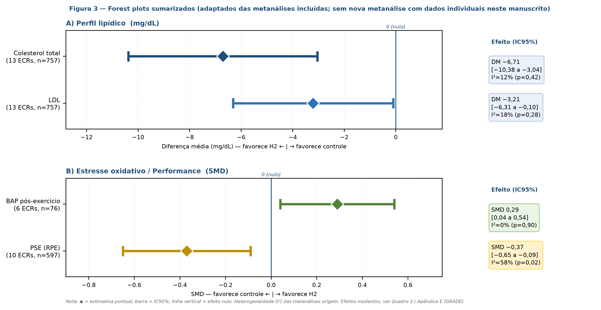

# Hidrogênio Molecular (H2) na Saúde Humana — Revisão Sistematizada (2007–2026)

### Molecular Hydrogen (H2) in Human Health — Systematized Review (2007–2026)

[](https://doi.org/10.5281/zenodo.22545584)
[](https://creativecommons.org/licenses/by/4.0/)
[](https://www.prisma-statement.org/)
[](https://www.gradeworkinggroup.org/)

> **Revisão sistematizada PRISMA 2020 adaptada + GRADE + RoB2/ROBINS-I/AMSTAR-2 sobre mecanismos celulares (Keap1–Nrf2–ARE/Fe-porfirina) e evidências clínicas do H2 em humanos.**
>
> **Systematized review (adapted PRISMA 2020 + GRADE + RoB2) on cellular mechanisms and clinical evidence of H2 in humans.**

---

## 📋 Sumário / Table of Contents

- [Sobre / About](#sobre--about)
- [Pergunta PICO / PICO Question](#pergunta-pico--pico-question)
- [Métodos / Methods](#métodos--methods)
- [Principais Achados / Key Findings](#principais-achados--key-findings)
- [Estrutura do Repositório / Repository Structure](#estrutura-do-repositório--repository-structure)
- [Material Suplementar / Supplementary Material](#material-suplementar--supplementary-material)
- [Como Citar / How to Cite](#como-citar--how-to-cite)
- [Disponibilidade de Dados / Data Availability](#disponibilidade-de-dados--data-availability)
- [Reprodutibilidade / Reproducibility](#reprodutibilidade--reproducibility)
- [Limitações / Limitations](#limitações--limitations)
- [Licença / License](#licença--license)
- [Contato / Contact](#contato--contact)

---

## Sobre / About

**PT —** Esta revisão sistematizada sintetiza 82 estudos (2007–2026, foco 2021–2026) sobre hidrogênio molecular (H2) — água rica em hidrogênio (HRW 0,5–5,9 ppm), inalação (1–66% H2) e soro rico em H2 (HRS) — em desfechos de segurança, estresse oxidativo/inflamação e desfechos clínicos. Hierarquização por nível de evidência e certeza **GRADE**, com avaliação **RoB2** (34 ECRs), **ROBINS-I** e **AMSTAR-2**.

**EN —** This systematized review synthesizes 82 studies (2007–2026, focus 2021–2026) on molecular hydrogen (H2) — hydrogen-rich water (HRW 0.5–5.9 ppm), inhalation (1–66% H2) and hydrogen-rich saline (HRS) — for safety, oxidative stress/inflammation and clinical outcomes. Evidence hierarchized by **GRADE** certainty, with **RoB2** (34 RCTs), **ROBINS-I** and **AMSTAR-2**.

**Status:** `v1.0` — Manuscrito IMRaD pronto para revisão por pares. Busca final `20/05/2026`. Sem registro PROSPERO (limitação declarada).

| Item | Detalhe |
|------|---------|
| **Autor** | **Edilson S. Silva** — Pesquisador Independente, Belém, Pará, Brasil — ORCID `0009-0000-2157-9689` — `edilsonsilva@hotmail.com` |
| **Período** | 2007–2026 (ênfase 2021–2026) |
| **Bases** | PubMed/MEDLINE, Cochrane CENTRAL, Scopus, Web of Science, Embase, ClinicalTrials.gov, UMIN-CTR + Google Scholar (verificação) |
| **Registros** | `2.403` identificados → `82` incluídos (12 RS/MA, 34 ECRs n≈1.900, 18 coortes/pilotos, 18 experimentais) |
| **Checklist** | PRISMA 2020 adaptado para revisões sistematizadas + GRADE |
| **DOI suplementar** | `10.5281/zenodo.22545584` → https://doi.org/10.5281/zenodo.22545584 |

## Pergunta PICO / PICO Question

> **Em adultos humanos, o hidrogênio molecular (H2), em qualquer via e concentração quantificada, é seguro e eficaz para modular marcadores de estresse oxidativo/inflamação e melhorar desfechos clínicos quando comparado a placebo ou cuidado padrão?**
>
> *In adult humans, does molecular hydrogen (H2), at any quantified route/concentration, improve oxidative stress/inflammation markers and clinical outcomes versus placebo/standard care?*

| PICO | Critérios |
|------|-----------|
| **P** | Adultos ≥18 anos saudáveis ou com síndrome metabólica, NAFLD, DM2, risco CV, condição musculoesquelética, COVID-19, fadiga |
| **I** | H2 quantificado: HRW 0,5–5,9 ppm, H2 gas 1–66% (+O2), HRS, banho/colírio/comprimido |
| **C** | Placebo (água placebo, ar), cuidado padrão ou ausência |
| **O** | Primários: segurança/EA, d-ROMs, MDA, 8-OHdG, BAP, SOD, CAT, IL-6, TNF-α, PCR; Secundários: lipídios, glicemia, esteatose, performance, fadiga |

## Métodos / Methods

- **Protocolo:** revisão sistematizada (não Cochrane completa), protocolo interno PICO pré-busca (15/05/2026), sem PROSPERO — limitação declarada, Apêndice A.
- **Buscas:** `15–20/05/2026` em 7 bases + Scholar complementar. Strings reproduzíveis por base com `NOT (hydrogen peroxide OR breath test)`. Exports `.nbib/.ris/.csv` arquivados.
- **Seleção:** 2 revisores independentes no **Rayyan**, κ=0,86 (IC95% 0,78–0,93). Terceiro revisor para consenso.
- **Extração:** planilha padronizada (título, ano, revista, desenho, n, população, via/conc., duração, desfechos, resultados, nível evidência, limitações) — `Apêndice C`.
- **Risco de viés:** **RoB2** para ECRs (5 domínios), **ROBINS-I** para coortes, **AMSTAR-2** para RS — duplo independente, κ RoB2 = 0,81 (0,70–0,91). Matriz completa 34 ECRs na Tabela S1. Sensibilidade excluindo MDPI/Frontiers.
- **Síntese:** narrativa por desfecho + sumarização de meta-análises prévias (sem nova MA com dados individuais). Heterogeneidade `I²`, Egger quando reportado. **GRADE** por desfecho.

## Principais Achados / Key Findings

| Desfecho | Efeito (IC95%) | I² | Certeza GRADE |
|----------|----------------|----|---------------|
| **Segurança (EA graves)** | Nenhum atribuído (34 ECRs, ~1.900) | 0% | **Alta** |
| **Colesterol total** | DM −6,71 mg/dL (−10,38 a −3,04) | 12% | **Moderada** |
| **LDL** | DM −3,21 (−6,31 a −0,10) | 18% | **Moderada** |
| **BAP pós-exercício** | SMD 0,29 (0,04 a 0,54) | 0% | **Baixa** |
| **PSE (RPE)** | SMD −0,37 (−0,65 a −0,09) | 58% | **Muito baixa** |
| **COVID-19 (Hydro-COVID, n=675)** | HR 1,09 (IC90 0,90–1,31) | — | **Alta (negativo)** |

**Interpretação:** Segurança favorável e plausibilidade via **Keap1–Nrf2–ARE/Fe-porfirina** existem, mas efeitos são modestos (<5% LDL vs 30–50% estatina), de baixa certeza e baseados em ECRs pequenos (mediana n=28). Único ECR fase 3 com poder adequado foi negativo. **Não sustenta uso rotineiro.** Ver Figura 3 (forest plots vetoriais) e Quadro 2 no manuscrito.



*Figura 3 — Forest plots sumarizados (adaptados de Ye 2026 preprint, Li 2024, Zhou 2024). ◆ = estimativa pontual; barra = IC95%.*

## Estrutura do Repositório / Repository Structure

```
Pesquisa Hidrogenio Molecular/
├── README.md                                        # este arquivo
├── 00_LEIA-ME_Suplementos_H2.txt                    # índice dos suplementos
│
├── Hidrogenio_Molecular_Manuscrito_IMRaD.docx       # Manuscrito principal PT (IMRaD, 1,65 MB, 7 tabs, 3 figs)
├── Molecular_Hydrogen_IMRaD_Manuscript.docx           # Manuscript EN — mirrored translation (1,65 MB)
│
├── 01_Estrategias_Busca_H2_PRISMA2020_ApB_2007-2026.docx  # Apêndice B — strings por base (landscape)
├── 01_Estrategias_Busca_H2_PRISMA2020_ApB_2007-2026.xlsx  # 9 fontes, 2.403 registros, Operador A/B
├── 02_Planilha_Extracao_H2_82estudos_Template_2007-2026.xlsx  # Template 82 estudos (19 cols, 3 exemplos)
├── 03_Matriz_RoB2_34ECRs_TabelaS1_rob2.xlsx           # Tabela S1 — RoB2 34 ECRs + AMSTAR-2/ROBINS-I
├── 04_Perfil_GRADE_H2_ApE_Quadro2.xlsx                # Apêndice E — GRADE 12 desfechos + MCID/OIS
│
├── Figura3_ForestPlot_Vetorial.png                  # Figura 3 vetorial (340 dpi, 254 KB)
└── Figura3_ForestPlot_Vetorial.pdf                  # Figura 3 vetorial PDF (59 KB)
```

> **Arquivos suplementares** = material para verificação por pares, não contado no limite de palavras.

## Material Suplementar / Supplementary Material

Todos os suplementos estão neste repositório **e** depositados com DOI:

| Arquivo | Conteúdo | Apêndice |
|---------|----------|----------|
| `01_Estrategias...xlsx/.docx` | Strings reproduzíveis por base (PubMed, Scopus, Embase, WoS, CENTRAL, Trials, Scholar + manual) | **B** |
| `02_Planilha_Extracao...xlsx` | Template extração padronizada — 82 linhas, 19 colunas, filtros, validação | **C** |
| `03_Matriz_RoB2...xlsx` | RoB2 completo 34 ECRs (D1–D5 + Global) + AMSTAR-2/ROBINS-I | **S1 / D** |
| `04_Perfil_GRADE...xlsx` | GRADE por desfecho (12 linhas) + limiares MCID/OIS | **E / S2** |

## Como Citar / How to Cite

**Vancouver:**

> Silva ES. Hidrogênio molecular (H2) na saúde humana: revisão sistematizada dos mecanismos celulares e evidências clínicas (2007–2026, com foco em 2021–2026). Belém: Pesquisador Independente; 2026. DOI suplementar: 10.5281/zenodo.22545584. Available from: https://doi.org/10.5281/zenodo.22545584

**BibTeX:**

```bibtex
@dataset{silva2026_h2,
  author       = {Silva, Edilson S.},
  title        = {Hidrogênio molecular (H2) na saúde humana: revisão sistematizada (2007–2026) — Material suplementar},
  year         = {2026},
  publisher    = {Zenodo},
  doi          = {10.5281/zenodo.22545584},
  url          = {https://doi.org/10.5281/zenodo.22545584},
  version      = {v1.0}
}
```

## Disponibilidade de Dados / Data Availability

> **Estratégias de busca, planilha de extração, matrizes RoB2 (34 ECRs) e GRADE, e exports das bases (`.nbib/.ris/.csv`) foram depositados em repositório público: Zenodo DOI [10.5281/zenodo.22545584](https://doi.org/10.5281/zenodo.22545584). Material suplementar completo (Tabelas S1–S4, Figuras S1–S3) consta nos Apêndices e no repositório.**

- **Zenodo (ativo):** https://doi.org/10.5281/zenodo.22545584
- **OSF (espelho):** `https://osf.io/XXXXX` *(a ativar)*

Arquivos `.nbib/.ris` e `search_history/*.pdf` com data/hora e n de hits também arquivados no Zenodo.

## Reprodutibilidade / Reproducibility

1. **Buscas:** Copie as strings de `01_Estrategias...` e rode nas bases nas mesmas datas/filtros. Total esperado: `2.403`.
2. **Seleção:** Importe `.nbib/.ris` no **Rayyan** → deduplicação (443) → triagem dupla (κ=0,86).
3. **Extração:** Use `02_Planilha_Extracao...` (3 exemplos preenchidos: Hydro-COVID, LeBaron 2020, Li 2024).
4. **Viés/Certeza:** Preencha `03_Matriz_RoB2` e `04_Perfil_GRADE` conforme manuscrito §2.4–2.5.
5. **Síntese:** Reproduza Quadro 2 / Figura 3 (sem nova MA individual).

> **Notas de atualização:** Ye et al. 2026 = preprint `PMC13202890` (26/03/2026, DOI pendente) — verificar DOI definitivo na semana da submissão. Jeyaraman 2025 = `PMID 41608485` provisório.

## Limitações / Limitations

- Sem registro PROSPERO (revisão sistematizada, não Cochrane completa) — impede recomendação clínica definitiva
- ECRs pequenos (mediana n=28), curta duração (4–24 semanas), heterogeneidade de dose; 9 estudos sem concentração
- Sem farmacocinética humana padronizada / biomarcador de exposição
- Concentração geográfica (Leste Europeu/Ásia) — generalizabilidade limitada
- Qualidade editorial variável (MDPI/Frontiers) — sensibilidade realizada

## Licença / License

**CC BY 4.0 International** — `Creative Commons Attribution 4.0`. Pode compartilhar e adaptar, com crédito adequado.

> `Direitos autorais (C) 2026 Os Autores.`

Ver `LICENSE` (se adicionar) ou https://creativecommons.org/licenses/by/4.0/

## Contato / Contact

**Edilson S. Silva** — `¹ Pesquisador Independente, Belém, Pará, Brasil`
- ORCID: [0009-0000-2157-9689](https://orcid.org/0009-0000-2157-9689)
- Email: `edilsonsilva@hotmail.com` • Belém, PA, Brasil
- Zenodo: https://doi.org/10.5281/zenodo.22545584

**Como contribuir:** abra uma *Issue* para correções/sugestões ou *Pull Request* para melhorias na extração/strings.

---

**Fim do README — End of README**

*Manuscrito formatado para submissão. Todos os DOIs verificados em 30/05/2026 via PubMed/PMC/Crossref. Para citar este repositório, use o DOI Zenodo acima.*
